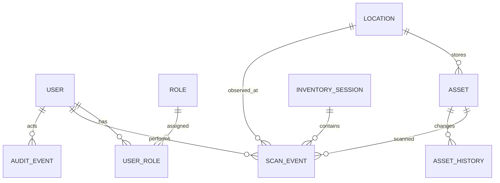

# 04 — Data Model

## 1. Core entities

### User
- id (UUID)
- email
- display_name
- status
- last_login_at
- failed_login_count
- force_password_reset
- created_at / updated_at

### Role
- id
- name
- description
- system_role boolean

### Permission
- id
- code
- description
- risk_level

### UserRole
- user_id
- role_id
- scope_type
- scope_id
- valid_from
- valid_to

### Asset
- id (UUID)
- asset_tag
- barcode
- serial_number
- sku
- service_tag
- imei
- category_id
- manufacturer
- model
- description
- status
- condition
- lifecycle_stage
- assignee_user_id
- department_id
- location_id
- purchase_date
- purchase_price
- currency
- depreciation_profile_id
- warranty_end_date
- created_at / updated_at
- version

### Location
- id
- name
- site_id
- parent_location_id
- type (site/building/floor/room/storage)
- address_text
- latitude nullable
- longitude nullable
- active

### InventorySession
- id
- name
- scope_type
- scope_id
- status (draft/active/paused/completed/cancelled)
- started_by
- started_at
- completed_at
- expected_count
- scanned_count
- verified_count
- exception_count

### ScanEvent
- id
- session_id nullable
- asset_id nullable
- raw_code
- code_type
- mode
- observed_location_id
- operator_user_id
- device_id/browser_session_id
- result_type
- exception_type nullable
- captured_at
- synced_at nullable
- client_operation_id

### AssetHistory
- id
- asset_id
- event_type
- previous_values JSON
- new_values JSON
- source_scan_event_id nullable
- performed_by
- performed_at

### AuditEvent
- id
- event_type
- actor_user_id
- subject_type
- subject_id
- action
- outcome
- before_json nullable
- after_json nullable
- reason_code nullable
- metadata_json
- correlation_id
- ip_address_hash / device metadata per privacy policy
- created_at

### OfflineOperation
- client_operation_id
- operation_type
- entity_type
- entity_id nullable
- payload_json
- base_version nullable
- local_created_at
- status
- retry_count
- last_error

## 2. Relationship summary

## 3. Key uniqueness rules
- `asset_tag` unique within enterprise.
- `barcode` unique when populated.
- `serial_number` should be unique within manufacturer/category policy; duplicates require review, not silent merge.
- `client_operation_id` globally unique for idempotent sync.

## 4. Versioning
Use optimistic concurrency with an integer `version` or equivalent ETag on mutable assets. Mutation requests must provide the version they were based on when conflict detection is required.
