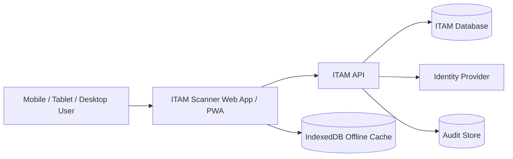

# System Context

```mermaid
flowchart LR
  U[Mobile / Tablet / Desktop User] --> PWA[ITAM Scanner Web App / PWA]
  PWA --> API[ITAM API]
  API --> DB[(ITAM Database)]
  API --> IAM[Identity Provider]
  API --> AUDIT[(Audit Store)]
  PWA --> IDB[(IndexedDB Offline Cache)]
```

The centralized API/database is authoritative. IndexedDB is a temporary operational cache and offline queue only.
